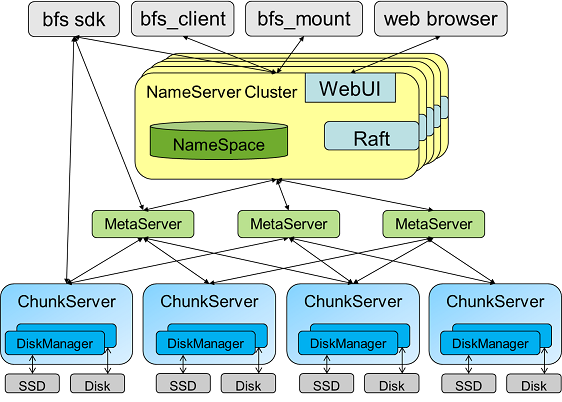

[The Baidu File System](http://github.com/baidu/bfs)
======

Travis  Coverity  

The Baidu File System (BFS) is a distributed file system designed to support real-time applications. Like many other distributed file systems, BFS is highly fault-tolerant. But different from others, BFS provides low read/write latency while maintains high throughout rates. Together with [Galaxy](https://github.com/baidu/galaxy) and [Tera](http://github.com/baidu/tera), BFS supports many real-time products in Baidu, including Baidu webpage database, Baidu incremental indexing system, Baidu user behavior analysis system, etc.

##背景
百度的核心数据库[Tera](http://github.com/baidu/tera)将数据持久化在分布式文件系统上，分布式文件系统的性能、可用性和扩展性对整个上层搜索业务的稳定性与效果有着至关重要的影响。现有的分布式文件系统无法很好地满足这几方面的要求，所以我们从Tera需求出发，开发了百度自己的分布式文件系统Baidu File System (BFS)。

##设计目标
1. 高可靠、高可用  
通过将数据副本进行多机房、多地域冗余，实现单个机房、地域遇到严重灾害的情况下，不丢失数据。  
将元数据服务分布化，通过多副本实现元数据服务的高可用，通过Raft等一致性协议同元数据操作日志，实现多副本的一致性。
2. 高吞吐、低延迟  
通过高性能的单机引擎，最大化存储介质IO吞吐；通过全局副本、流量调度，实现负载均衡。
3. 可水平扩展至万台规模  
设计支持两地三机房，1万+台机器管理。

##系统架构
系统主要由NameServer、ChunkServer、SDK和bfs_client等几个模块构成。  
其中NameServer是中心控制模块，负责目录树的管理；ChunkServer是数据节点负责提供文件块的读写服务；SDK以静态库的形式提供了用户使用的API；bfs_client是一个二进制的管理工具。  

## 构建
在百度内部，可以直接运行：  
sh internal_build.sh  
外部构建请参考.travis.yml中的步骤。  

## 单机Sandbox测试
Sandbox目录下包含了运行单机测试的环境和脚本。  
deploy.sh： 在本地部署一个包含4个chunkserver、1个nameserver的集群  
start.sh: 启动部署好的集群  
clear.sh: 清理集群  
small_test.sh 简单的自动化测试脚本，会调用上面三个脚本，并使用bfs_client测试文件系统的基本功能

## 系统搭建
1. 搭建NameServer  
Nameserver部署需要1~3台机器（$nshost1~3）  
Nameserver必须指定的flag：  
--nameserver_nodes=$nshost1:8828,$nshost2:8828,$nshost3:8828  
--node_index=$hostid  
启动命令:  
./nameserver --flagfile=./bfs.flag  
2. 搭建Chunkserver  
为了保证可用性，chunkserver至少需要4台机器(一台挂掉的情况下，仍然可写)  
Chunkserver必须指定的flag：  
--nameserver_nodes=$nshost1:8828,$nshost2:8828,$nshost3:8828  
--chunkserver_port=8825  
--block_store_path=/home/disk1/bfs,/home/disk2/bfs  
启动命令：  
./chunkserver --flagfile=./bfs.flag
3. 查看集群  
有两种方式可以查看集群：  
a) 命令行方式  
    ./bfs_client stat -a  
b) Web方式  
    用浏览器访问http://$nshost1:8828/dfs  

## 日志规则与说明
为了简化日志打印，并便于grep,  
所有block id的打印使用“#%ld "的格式（即前加#，后加空格）  
所有chunkserver id打印使用"C%d "的格式  
所有entry id打印使用"E%ld "的格式  
所有block version打印使用"V%ld "的格式

##前世
突然想写个分布式文件系统~
  1. 支持表格系统的持久化数据存储
  2. 支持混布系统的临时数据存储
  3. 支持mapreduce的大文件存储

想加入的人在这留个名吧：

yanshiguang~  
yuanyi~  
yuyangquan~  
leiliyuan~  
yangce~

